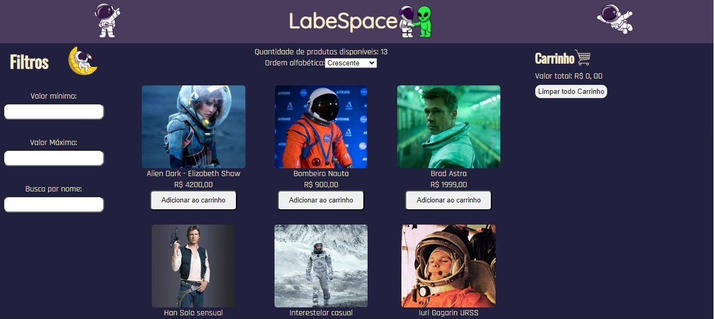

# LabeSpace

Página principal do projeto LabeSpace. Implementado utilizando React.JS, este projeto tem por objetivo a criação de um site de compra interativo onde o usuário consiga adicionar os produtos ao carrinho, assim como ordená-los alfabeticamente em ordem crescente e descrescente. Outra funcionalidade do site é o filtro por nome, preço mínimo e preço máximo. No carrinho o usuário consegue remover os produtos inseridos, assim como verá o preço total de sua compra.

## Logos utilizadas no projeto

### Link do projeto
https://krexu-mfl-labespace.surge.sh/

## Página principal

## Lista de Requisitos

### Home (Lista de Produtos)
 - [x] O usuário deve ser capaz de visualizar uma lista de produtos
 - [x] O usuário deve ser capaz de visualizar os dados do produto (nome, preço e imagem)
 - [x] O usuário deve ser capaz de adicionar um produto no carrinho
### Carrinho
 - [x] O usuário deve ser capaz de visualizar os produtos adicionados
 - [x] O usuário deve ser capaz de visualizar a quantidade correta de cada produto
 - [x] O usuário deve ser capaz de remover itens do carrinho
 - [x] O usuário deve ser capaz de ver corretamente o valor total de sua compra
 - [x] Quando a página é atualizada, os itens devem continuar no carrinho
### Filtros e Ordenação
 - [x] O usuário deve ser capaz de filtrar os itens por preço mínimo
 - [x] O usuário deve ser capaz de filtrar os itens por preço máximo
 - [x] O usuário deve ser capaz de realizar uma busca por nome
 - [x] O usuário deve ser capaz de ordenar os itens em ordem crescente ou decrescente
 - [x] O usuário deve ser capaz de adicionar filtros, busca e ordenação simultaneamente
 - [x] O usuário deve ser capaz de retornar à visualização sem filtros